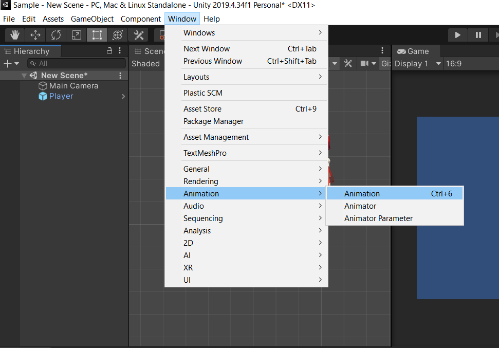
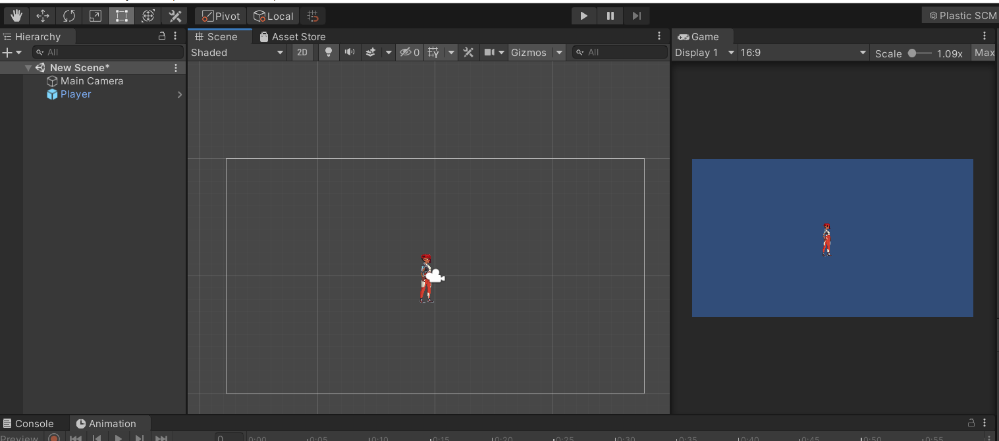
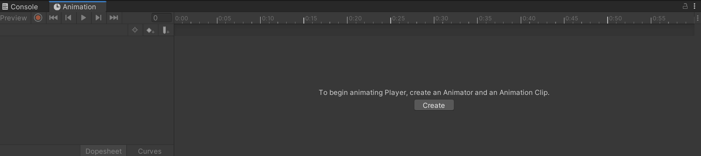

## 2. Animation View

- This is the place where you can manipulate and edit the animations for your game objects.
- To open the Animation view
    - Go to **Window** > **Animation**. (Shortcut key-  **CNTRL + 6**)
        
        

            
        

        

        

            
        

        

- To work in the animation view, you first need a gameObject in the scene, and in the project panel, you need to have the corresponding clips as assets.
    
    
    

            
        

- Select the gameObject (Player) in the Hierarchy Window.
- Now go to Animation View and click create.
    
    
    

            
    

- Then, make a separate animation folder to save the ‘.anim’ file. Also, change its name to something meaningful like ‘Player_idle.anim’ and save it.
    
    

            
    

- You will see the animation window changes to some timelines and keyframes view just like below.
    
    
    

        
    

- Now, Go to the folder in which you have all the clips of the gameObject for animation. Select all the clips and drag and drop them in the animation window.
- See the video for what happens next.

    

https://user-images.githubusercontent.com/59511246/152655976-3a289ba9-73aa-4dc9-b3f0-d4e6adef9ca4.mp4

- Yes, you are right, you’re animation is created for that particular gameObject.
- Create one more animation for the game object and we can go to the next part which is **Animator Window**.

<aside>

> 💡 🚀 **[Join Discord Server](https://discord.gg/J5zDscnzms) → Get your doubts solved by experts instantly**

</aside>

---
