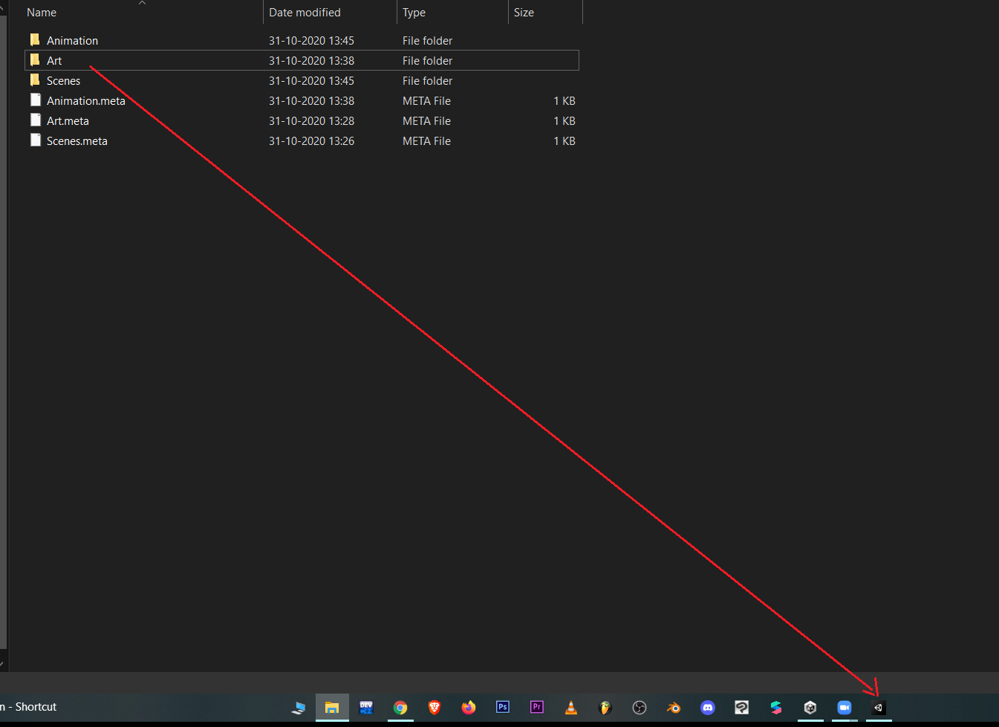
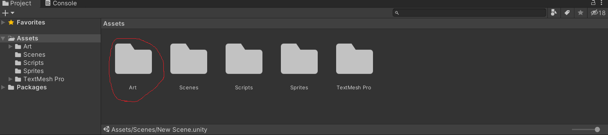

# Unity Animations

## Introduction

First of all, congrats for completing all the previous courses. You've come a long way. Yayyyy!!!🤘

If you’ve ever played a computer game then you must have noticed how the characters move. While moving, the character slightly bends forward, hands go up and down, hair flips, blinking eyes, and whatnot. All of these can be done using animations easily. For one eye blink movement, you can use multiple objects which contain information about changing the eye position, rotation, or other properties at a time. This is a concept of **[Animation Clips](https://docs.unity3d.com/Manual/AnimationClips.html)**. You will use multiple clips just for one hand movement or eye blink. In Unity, these Animation clips can be imported from external sources created by artists or animators with 3rd party tools.

**How to import such Assets in Unity?**
    
Just drag the asset from the folder you’ve stored it in and drop it in the Project Panel in Unity. We will see an example here-
    

    

    

After importing, Animation Clips are organized into a structured system called an [Animator Controller](https://docs.unity3d.com/Manual/class-AnimatorController.html). The Animator Controller acts as a “[State Machine](https://docs.unity3d.com/Manual/AnimationStateMachines.html)” which keeps track of which clip should currently be playing, and when the animations should change or blend together.

*We will look into how to make animations in much detail from the next section.*

Heads Up 👇
---
