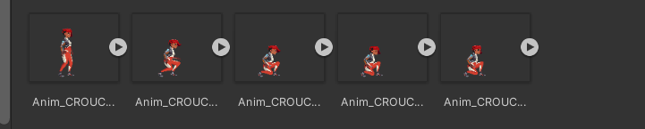

# Unity Animations

## Introduction

First of all, congrats on completing all the previous courses. You've come a long way. Yayyyy!!!🤘

If you’ve ever played a computer game then you must have noticed how the characters move. While moving, the character slightly bends forward, hands go up and down, hair flips, blinking eyes, and whatnot. All of these can be done using animations easily. For one eye blink movement, you can use multiple objects which are also known as sprites that contain information about changing the eye position, rotation, or other properties at a time. This is a concept of **[Animation Clips](https://docs.unity3d.com/Manual/AnimationClips.html)**. You will use multiple clips just for one hand movement or eye blink. In Unity, these Animation clips can be imported from external sources created by artists or animators with 3rd party tools.

### Before going through the course, we would like you to clone the [Github Repository](https://github.com/outscal/Unity-Animation) for the assets used in this project.

**What are sprite sheets?**

Every 2D graphical object in the game scene is a sprite. It can be anything, a player sprite, an enemy sprite, landscape sprite, and many more. In simple words, sprites are nothing but images in 2D games. Also, in animations, for each player's movement, there are multiple sprites attached to it. 

Sprite sheets in Unity are a way of collecting all the sprites and packing them together as one image or sprite. As multiple sprites are needed to create animations, these sprites could be packed as a sprite sheet in Game Assets. 

**How to import such Assets in Unity?**
    
Just drag the asset from the folder you’ve stored it in and drop it in the Project Panel in Unity. We will see an example here-
    

    

    

After importing, Animation Clips are organized into a structured system called an [Animator Controller]. The Animator Controller acts as a “[State Machine](https://docs.unity3d.com/Manual/AnimationStateMachines.html)” which keeps track of which clip should currently be playing, and when the animations should change or blend together.

## Enroll yourself and get rewarded when you complete the course 🎁

As you learn and upskill yourself, you can earn learning points. These points can be redeemed for rewards, as well as in tournaments. Enroll yourself for the course by filling the form linked to the gif below and start earning your points

**Click on the gif below and follow the instructions** ⏬

You can also click here - [Click Here!](https://airtable.com/shrY0mnlrnJXaZjps)

*We will look into how to make animations in much detail from the next section. 👉*

