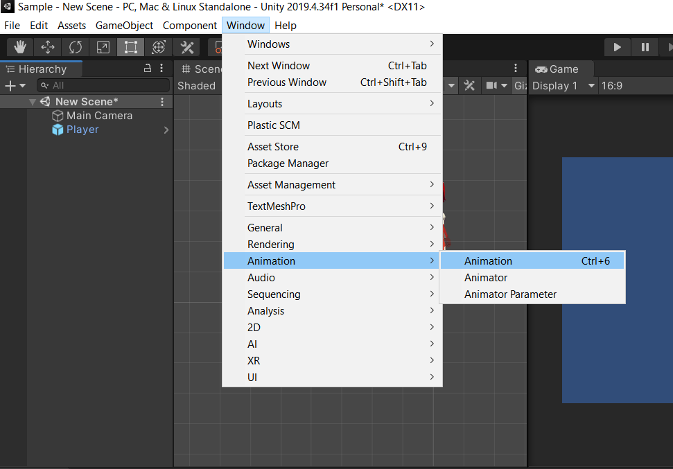
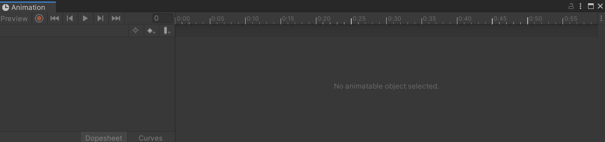
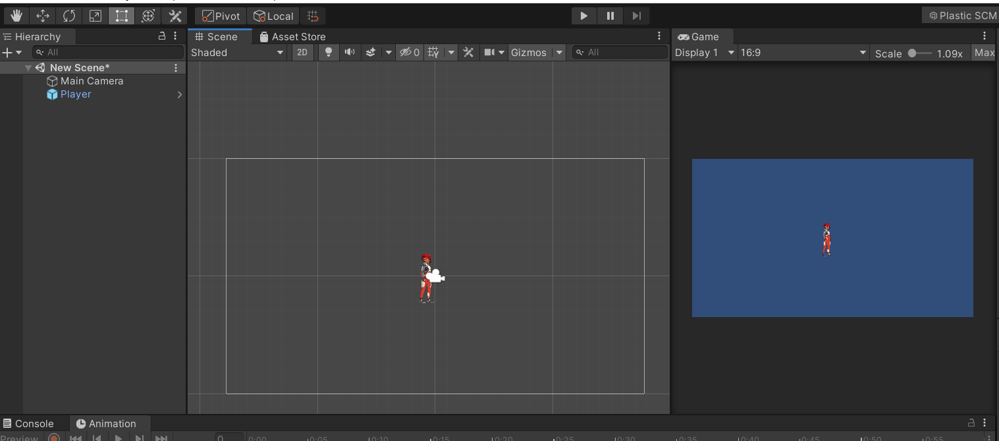
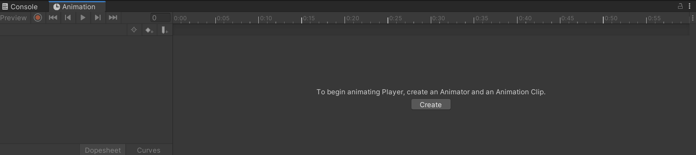
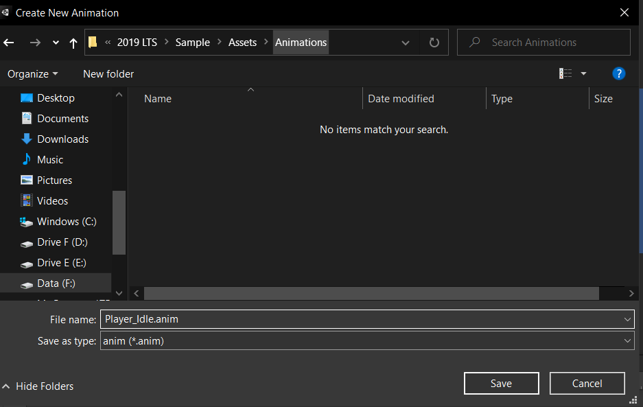
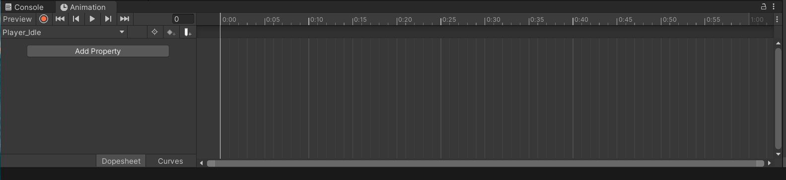

## Animation View

This is the place where you can manipulate and edit the animations for your game objects. 

To open the Animation view-:

Go to **Window** > **Animation**. (Shortcut key-  **CNTRL + 6**)
        

        

        

To work in the animation view, you first need a gameObject in the scene, and in the project panel, you need to have the corresponding clips as assets.
    
    

Select the gameObject (Player) in the Hierarchy Window.
Now go to Animation View and click create.
    
    

Then, make a separate animation folder to save the ‘.anim’ file. Also, change its name to something meaningful like ‘Player_idle.anim’ and save it.
    

You will see the animation window changes to some timelines and keyframes view just like below.
    
    

Now, Go to the folder in which you have all the clips of the gameObject for animation. Select all the clips and drag and drop them in the animation window.
See the video for what happens next.

    

https://user-images.githubusercontent.com/59511246/152655976-3a289ba9-73aa-4dc9-b3f0-d4e6adef9ca4.mp4

Yes, you are right, you’re animation is created for that particular gameObject.

Create one more animation for the game object and we can go to the next part which is **Animator Window**.

---
