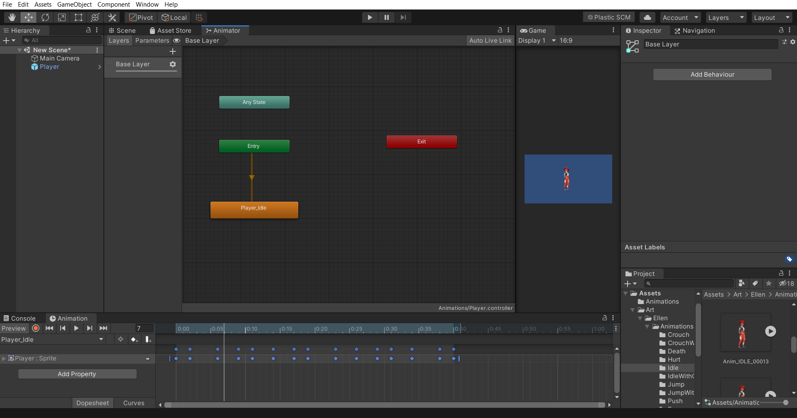
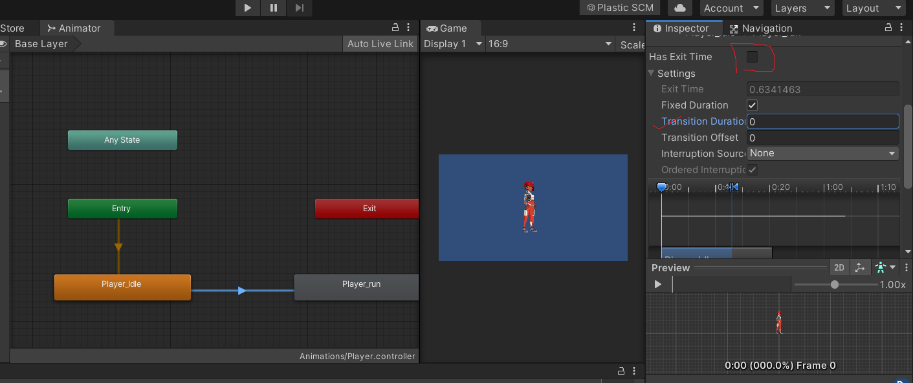
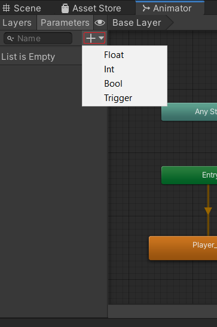
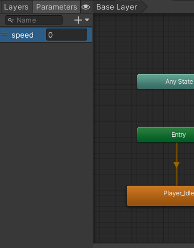
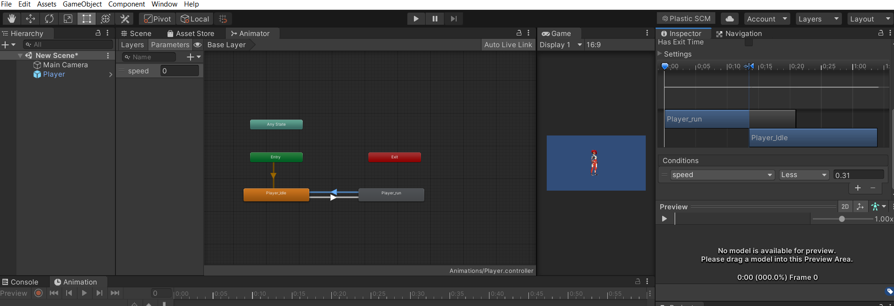

# Animator Window

Buckle Up!! This gonna be one of the most interesting that you'll learn in this course and the final one.

Now, comes the animator window. An **Animator Controller** allows you to arrange and maintain a set of animations for a character or other animated Game Object.

To open the animator window, go to **Window > Animation > Animator**.

_Make sure that the gameObject in the Hierarchy window is selected, else you won’t see anything in the animator window._

**Animator Window is the place where you will be able to transition a player's idle animation to other animations like run animation, jump animation, and so on.**

When you open the window, you can see all the colored rectangle boxes which are nothing but states.

Any state and Entry state comes by default in Unity. The meaning of these two is there in its name only - Any and Entry.

* Any State- You can go to any state of game object animation regardless of which state the game object is currently in.
* Entry State- Whenever the game starts and the game object first comes into the scene, it presents itself in the entry state. The Entry state then transitions to the first state of the game object. The first animation that you would create will always be linked to the Entry State.

As you have created another animation, so now we can learn about the transition from one state to another state.

We have taken two animations (you can create any) ——

1. Player Idle Animation
2. Player Run Animation

We will transition from the player idle state to the player run state.

Right Click in the Player Idle state

Select **Make Transition**.

Now, drop the transition arrow to the Player Run state by left-clicking in the mouse.

Select the **Transition arrow** and in the Inspector, unselect **Has Exit Time** and make the \*\*Transition Duration=\*\*0, as shown in the image. By default, the Transition Duration is 0.25. But we want to transition it quickly without time delay. If “Has Exit Time” is enabled, this value represents **the exact time at which the transition can take effect** and we don’t want that to happen here, for the current scenario.

Now we need to define the condition at which the transition will happen from the idle state to the run state.

Now in the Animator window, select the Parameters in the top-left corner beside the Layers. That’s where you can give the data for the conditions.

To work around conditions you must have some values. On the basis of these values, you would apply conditions.

To create data click on the **+** **button.**

Float, Int, Bool and Trigger. These are data types. You can select float for now and type a meaningful name like speed.

Now, again click on the transition arrow and in the inspector go to conditions.

Select + and condition to “Greater” and the value 0.3.

This is just for one transition which is, from idle state to run state. You need to go from run state to idle state as well.

So follow the exact steps that are done here to transition and set the conditions. You may refer to the image given below.

Now play it and change the speed values in Parameters.

### Wrapping Up

We covered a lot in this one. Feel free to take a breather over here.

Maybe share your progress with the world via LinkedIn & Twitter?

Once you're done posting fill this [form](https://airtable.com/shrXGSkgf5NClpoIU) so that we can also track your progress and give you cool stuff for getting this far!

***
